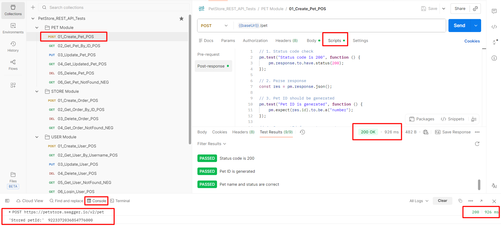
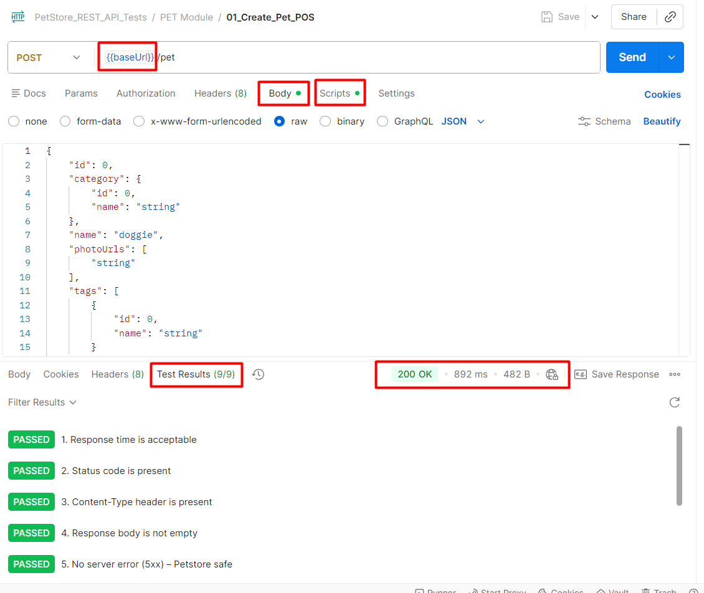
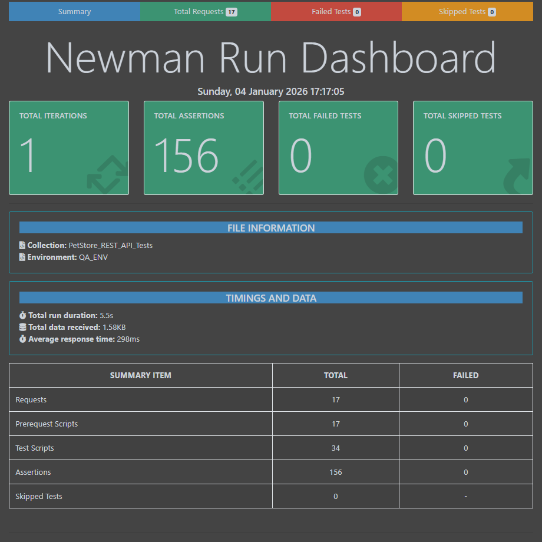

# 🚀 PetStore API Automation – Postman & Newman
[](https://www.postman.com/)
[](https://developer.mozilla.org/en-US/docs/Web/JavaScript)
[](https://learning.postman.com/docs/running-collections/using-newman-cli/command-line-integration-with-newman/)
[](https://github.com/GauravSunilJangam)









---

## 📌 Project Overview
This project demonstrates **end-to-end REST API automation testing** using **Postman** and **Newman** on the **Swagger PetStore Public REST API**.

The framework is designed to validate:
- ✅ **Positive scenarios**
- ❌ **Negative scenarios**
- 🔁 **Regression test coverage**

It supports **environment-based execution** and generates **detailed HTML reports** for easy analysis.

---

## 🧪 Application Under Test
**Swagger PetStore – Public REST API**

🔗 **Base URL:**  
 https://petstore.swagger.io


---

## 🧩 Modules Covered

### 🐶 Pet Module
- Create Pet
- Get Pet by ID
- Update Pet
- Delete Pet
- Pet Not Found (Negative)

### 🛒 Store Module
- Create Order
- Get Order by ID
- Delete Order
- Order Not Found (Negative)

### 👤 User Module
- Create User
- Get User
- Update User
- Delete User
- Login User
- Logout User

---

## 🛠 Tech Stack
- **Postman** – API testing & scripting  
- **Newman** – Command-line collection runner  
- **newman-reporter-htmlextra** – Rich HTML reports  
- **JavaScript** – Assertions & test logic  
- **Git & GitHub** – Version control  

---

## 📂 Project Structure


petstore-api-automation-postman

├── postman
│   ├── collections
│   │   └── petstore_api_collection.postman_collection.json
│   └── environments
│       └── petstore_qa_environment.postman_environment.json
├── reports
│   └── PetStore_Report.html
└── README.md

---

## ⚙️ Environment Configuration
The project uses **Postman Environment Variables** for dynamic execution:

| Variable   | Description |
|------------|-------------|
| `baseUrl`  | API base URL |
| `petId`    | Dynamic pet ID |
| `orderId`  | Dynamic order ID |
| `username` | User login name |
| `password` | User password |

📄 **Environment File:**  


postman/environments/petstore_qa_environment.postman_environment.json


---

## ▶️ How to Execute Using Newman

### 🔹 Prerequisites
- Node.js installed  
- Newman installed globally

```bash
npm install -g newman
npm install -g newman-reporter-htmlextra


🔹 Run Collection with HTML Report
newman run postman/collections/petstore_api_collection.postman_collection.json \
-e postman/environments/petstore_qa_environment.postman_environment.json \
-r cli,htmlextra \
--reporter-htmlextra-export reports/PetStore_Report.html

📊 Test Report

After execution, an HTML execution report is generated at:

reports/PetStore_Report.html

Open this file in any browser to view:
Request-wise execution status
Assertions summary
Response times
Failure details (if any)


## 🧪 Test Summary

| Module | Total APIs | Positive | Negative | Status |
|------|-----------|----------|----------|--------|
| Pet | 6 | 5 | 1 | ✅ Passed |
| Store | 4 | 3 | 1 | ✅ Passed |
| User | 7 | 6 | 1 | ✅ Passed |
| **Total** | **17** | **14** | **3** | ✅ Passed |


✅ Key Highlights

Environment-based execution

Collection-level common assertions
Dynamic ID handling using environment variables
Swagger PetStore instability handled gracefully (5xx safe assertions)
Newman CLI execution with HTML report
CI/CD ready structure

👤 Author

Gaurav Sunil Jangam
API Automation Tester | Postman | Newman | REST API Testing

⭐ If you find this project useful, feel free to star the repository.